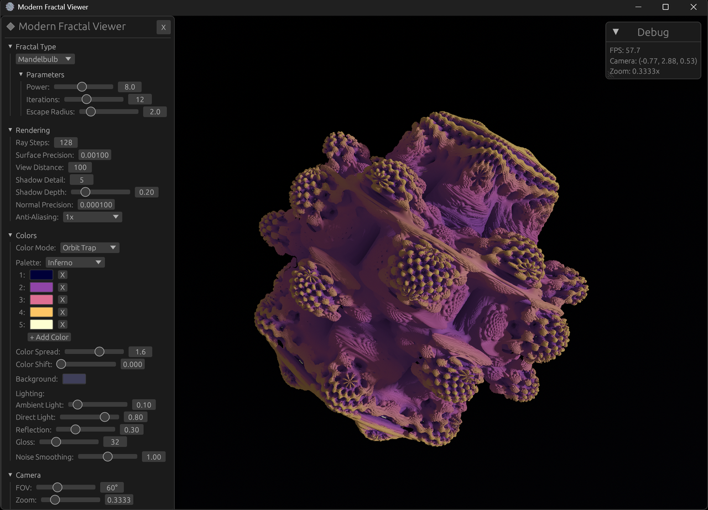

# Modern 3D Fractal Viewer

[](https://github.com/jiamingfeng/ModernFractalViewer/actions/workflows/build-pc.yml)
[](https://github.com/jiamingfeng/ModernFractalViewer/actions/workflows/build-web.yml)
[](https://github.com/jiamingfeng/ModernFractalViewer/actions/workflows/build-android.yml)
[](https://jiamingfeng.github.io/ModernFractalViewer/)

A cross-platform 3D fractal viewer using ray marching, built with Rust.

**[▶️ Try it Live in Your Browser](https://jiamingfeng.github.io/ModernFractalViewer/)** *(Requires WebGPU-enabled browser)*



## Features

- **6 Fractal Types**: Mandelbulb, Menger Sponge, Julia 3D, Mandelbox, Sierpinski, Apollonian
- **Real-time Ray Marching**: GPU-accelerated signed distance field rendering
- **Interactive UI**: egui-based parameter tweaking with live preview
- **Cross-Platform**: Windows, macOS, Linux, Android, and WebAssembly
- **Deep Zoom Support**: Double-single precision emulation for zoom levels up to 10^12
- **Switchable Lighting**: Blinn-Phong and PBR (Cook-Torrance GGX) with interactive light direction control

## Controls

| Action | Mouse | Touch |
|--------|-------|-------|
| Orbit camera | Left click + drag | Single finger drag |
| Pan camera | Right click + drag | Two finger drag |
| Zoom | Scroll wheel | Pinch |
| Light direction | L + drag | - |
| Toggle UI | ESC | - |
| Reset camera | R | - |
| Auto-rotate | Space | - |

For a comprehensive feature reference, see the [User Guide](docs/USER_GUIDE.md).

## Building

### Prerequisites

- Rust 1.75+ (install via [rustup](https://rustup.rs/))
- For Android: Android NDK
- For Web: wasm-pack

### Windows / macOS / Linux

```bash
# Debug build
cargo run -p fractal-app

# Release build (optimized)
cargo run -p fractal-app --release
```

### WebAssembly (WebGPU)

The web build uses WebGPU for GPU-accelerated rendering. To run the live demo or build locally:

**Browser Requirements:**
- Chrome 113+ / Edge 113+ (WebGPU enabled by default)
- Firefox Nightly (enable `dom.webgpu.enabled` in about:config)
- Safari 18+ (macOS Sequoia / iOS 18)

```bash
# Install trunk for building
cargo install trunk

# Build and serve locally
cd crates/fractal-app
trunk serve --release --port 8080
# Open http://localhost:8080
```

Alternative build with wasm-pack:

```bash
# Install wasm-pack if not already installed
cargo install wasm-pack

# Build for web
cd crates/fractal-app
wasm-pack build --target web

# Serve locally
python -m http.server 8080
# Open http://localhost:8080
```

### Android

```bash
# Install cargo-ndk
cargo install cargo-ndk

# Build for Android
cargo ndk -t arm64-v8a -o app/src/main/jniLibs build -p fractal-app --release
```

## Project Structure

```
fractal-viewer/
├── crates/
│   ├── fractal-core/      # Core math and fractal definitions
│   ├── fractal-renderer/  # wgpu rendering pipeline
│   ├── fractal-ui/        # egui UI components
│   └── fractal-app/       # Main application
├── plans/                 # Architecture documentation
└── Cargo.toml             # Workspace configuration
```

## Technical Details

### Ray Marching

The viewer uses ray marching with signed distance functions (SDFs) to render 3D fractals. Each pixel:

1. Casts a ray from the camera
2. Marches along the ray, evaluating the SDF at each step
3. Stops when the distance is below epsilon (hit) or exceeds max distance (miss)
4. Calculates normal, lighting, and coloring

### WGSL Shaders

Shaders are written in WGSL (WebGPU Shading Language). The wgpu library uses [Naga](https://github.com/gfx-rs/wgpu/tree/trunk/naga) to transpile WGSL to:

- **SPIR-V** for Vulkan (Windows, Linux, Android)
- **MSL** for Metal (macOS, iOS)
- **HLSL** for DirectX 12 (Windows)
- **WGSL** for WebGPU (browsers)

### Double Precision Emulation

For deep zoom, we use double-single arithmetic - representing numbers as `hi + lo` where `hi` and `lo` are both `f32`. This provides ~14 digits of precision instead of ~7.

## Development

For testing instructions and the full test inventory, see the [Testing Guide](docs/TESTING.md).

## License

MIT License
