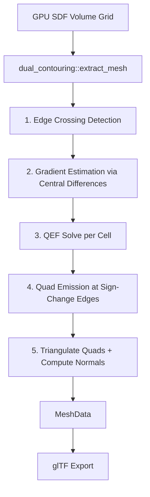

# Dual Contouring Implementation Plan

## Problem

The current Marching Cubes mesh export produces non-watertight meshes with broken faces. Dual Contouring (Ju et al. 2002) produces superior meshes:
- **Watertight** — guaranteed manifold output for clean SDF data
- **Sharp features** — QEF-based vertex placement preserves edges and corners
- **One vertex per cell** — cleaner topology with shared vertices (vs MC's per-triangle vertices)
- **Quad-based** — natural quad mesh that triangulates cleanly

## Architecture Overview



## Files to Create/Modify

### New Files

1. **`crates/fractal-core/src/mesh/dual_contouring.rs`** — Main DC algorithm
2. **`crates/fractal-core/src/mesh/qef.rs`** — QEF solver (3x3 SVD least-squares)

### Modified Files

3. **`crates/fractal-core/src/mesh/mod.rs`** — Add `MeshMethod` enum, register new modules
4. **`crates/fractal-ui/src/panels/export_panel.rs`** — Method selection UI dropdown
5. **`crates/fractal-app/src/app.rs`** — Dispatch to DC or MC based on config

## Detailed Design

### 1. QEF Solver — `qef.rs`

The Quadratic Error Function minimizes the sum of squared distances from a point to a set of planes. Each plane is defined by an edge crossing point and its SDF gradient normal.

```
minimize ||A*x - b||^2 subject to x inside cell bounds
```

Where:
- Each row of A is a gradient normal `n_i`
- Each element of b is `dot(n_i, p_i)` where `p_i` is the edge crossing point

**Implementation approach**: Direct 3x3 normal equations (`A^T * A * x = A^T * b`) with pseudo-inverse via eigenvalue decomposition. For a 3x3 symmetric matrix this can be done analytically or with a simple iterative solver. If the system is rank-deficient (e.g., flat surface with all normals parallel), fall back to mass point (average of edge crossings).

```rust
pub struct QefSolver {
    ata: [f32; 6],        // Upper triangle of A^T*A (symmetric 3x3)
    atb: [f32; 3],        // A^T*b
    mass_point: [f32; 3], // Average of intersection points
    count: u32,           // Number of planes added
}

impl QefSolver {
    pub fn new() -> Self;
    pub fn add_plane(normal: [f32; 3], point: [f32; 3]);
    pub fn solve(cell_min: [f32; 3], cell_max: [f32; 3]) -> [f32; 3];
}
```

The `solve` method:
1. Compute `(A^T A)^{-1} A^T b` via Cholesky or pseudo-inverse
2. If solution is outside cell bounds, clamp to cell or fall back to mass point
3. Return the optimal vertex position

### 2. Dual Contouring Algorithm — `dual_contouring.rs`

**Same function signature as marching_cubes** for drop-in replacement:

```rust
pub fn extract_mesh(
    grid: &[[f32; 2]],    // [distance, trap] per vertex
    dims: [u32; 3],       // cells per axis
    bounds_min: [f32; 3],
    bounds_max: [f32; 3],
    iso_level: f32,
    compute_normals: bool,
    progress: Option<&dyn Fn(f32)>,
) -> MeshData
```

**Algorithm phases:**

#### Phase A: Build cell vertex map `HashMap<(u32,u32,u32), usize>`
For each cell `(cx, cy, cz)`:
1. Read 8 corner SDF values
2. Check if any of the 12 edges have a sign change (one corner < iso, other >= iso)
3. If yes: for each sign-changing edge, compute intersection point via linear interpolation and estimate gradient via central differences
4. Solve QEF to get optimal vertex position
5. Store vertex index in map; push position, interpolated trap value to output arrays

#### Phase B: Emit quads for sign-changing edges
For each **interior** edge in the grid (edges shared by exactly 4 cells):
- **X-axis edges** at `(cx, cy, cz)`: shares cells `(cx, cy, cz)`, `(cx, cy-1, cz)`, `(cx, cy, cz-1)`, `(cx, cy-1, cz-1)`
- **Y-axis edges** at `(cx, cy, cz)`: shares cells `(cx, cy, cz)`, `(cx-1, cy, cz)`, `(cx, cy, cz-1)`, `(cx-1, cy, cz-1)`
- **Z-axis edges** at `(cx, cy, cz)`: shares cells `(cx, cy, cz)`, `(cx-1, cy, cz)`, `(cx, cy-1, cz)`, `(cx-1, cy-1, cz)`

If both endpoints of the edge have different signs, and all 4 neighbouring cells have vertices, emit a quad.

**Winding order**: Determine from the sign change direction (which endpoint is inside). For SDF where negative = inside, if the edge goes from negative to positive along the axis direction, wind one way; if positive to negative, wind the other way.

#### Phase C: Triangulate and compute normals
- Split each quad into 2 triangles (shorter diagonal split for better shape)
- Compute normals: gradient-based (from SDF central differences at vertex positions) or face normals

### 3. ExportConfig Changes — `mesh/mod.rs`

```rust
#[derive(Debug, Clone, Copy, PartialEq, Eq, Serialize, Deserialize)]
pub enum MeshMethod {
    MarchingCubes,
    DualContouring,
}

impl Default for MeshMethod {
    fn default() -> Self {
        MeshMethod::DualContouring // New default
    }
}
```

Add `pub method: MeshMethod` field to `ExportConfig`.

### 4. UI Changes — `export_panel.rs`

Add a ComboBox before the resolution selector:
```
Method: [Dual Contouring ▼]
         Dual Contouring
         Marching Cubes
```

### 5. App Pipeline Changes — `app.rs`

In `spawn_export_thread`, dispatch based on `config.method`:
```rust
let mut mesh = match method {
    MeshMethod::DualContouring => dual_contouring::extract_mesh(...),
    MeshMethod::MarchingCubes => marching_cubes::extract_mesh(...),
};
```

## Key Design Decisions

1. **No external dependencies** — QEF solver implemented from scratch (only 3x3 linear algebra needed)
2. **Same grid data** — Reuses the existing GPU `[distance, trap]` volume; no shader changes needed
3. **Gradient from grid** — Central differences on the SDF grid, same approach as current MC normals
4. **Clamped QEF** — Vertex positions clamped to cell bounds to prevent self-intersections
5. **Mass-point fallback** — When QEF is degenerate (rank < 2), use average of intersection points
6. **NaN safety** — Same sanitization pattern as MC implementation
7. **Shared vertex topology** — DC naturally produces shared vertices (one per cell), giving much fewer vertices than MC for the same resolution

## Test Plan

| Test | Description |
|------|-------------|
| `sphere_sdf_produces_mesh` | 16^3 sphere at origin, verify non-empty mesh |
| `sphere_is_watertight` | Check Euler characteristic: V - E + F = 2 |
| `all_positive_empty` | All values > iso → empty mesh |
| `all_negative_empty` | All values < iso → empty mesh |
| `empty_grid_empty` | Zero dims → empty mesh |
| `normals_point_outward` | >95% of normals dot position > 0 for sphere |
| `no_nan_in_output` | No NaN/Inf in positions/normals/colors |
| `nan_in_grid_safe` | Injected NaN → still no NaN in output |
| `progress_monotonic` | Progress callback [0, 1] monotonically |
| `vertices_inside_cells` | Every DC vertex lies within its cell bounds |
| `cube_sdf_sharp_edges` | Box SDF preserves sharp edges (vertices near actual edges) |
