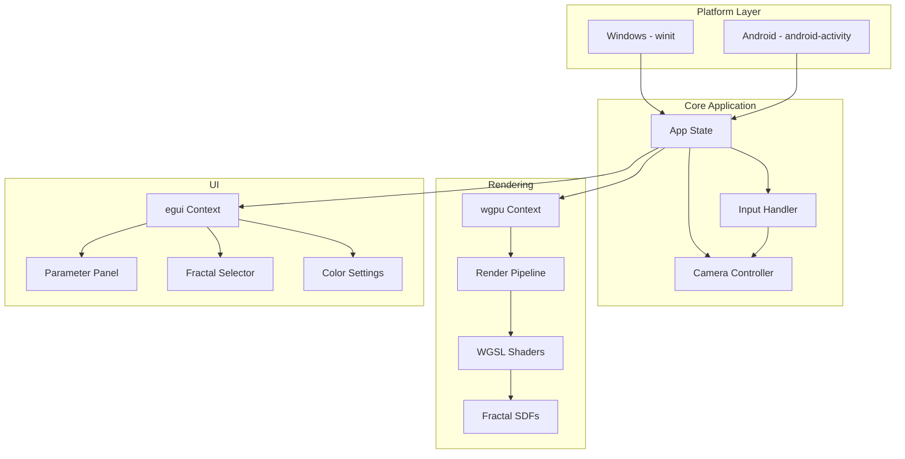
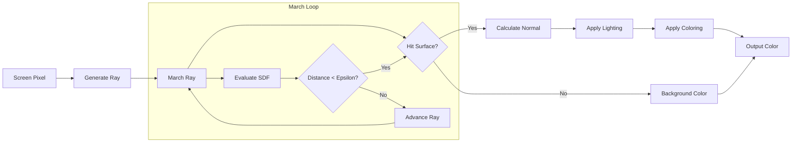

# 3D Fractal Viewer - Architecture Plan

## Overview

A cross-platform (Windows/macOS/Android/Web) 3D fractal viewer built with Rust, featuring ray-marched distance field rendering, **emulated double precision for deep zoom**, and an egui-based parameter tweaking interface.

## Target Platforms

| Platform | Backend | Status |
|----------|---------|--------|
| **Windows** | Vulkan / DX12 | Primary development |
| **macOS** | Metal | Supported |
| **Linux** | Vulkan | Supported |
| **Android** | Vulkan | Supported |
| **Web** | WebGPU | Supported (wasm32) |

## Technology Stack

| Component | Technology | Rationale |
|-----------|------------|-----------|
| **Language** | Rust | Learning opportunity, memory safety, modern tooling |
| **Graphics** | wgpu | Cross-platform abstraction over Vulkan/DX12/Metal/WebGPU |
| **Windowing** | winit | Native support for all target platforms |
| **UI** | egui | Immediate-mode GUI, touch-friendly, wgpu integration |
| **Math** | glam | Fast SIMD math, wgpu-compatible types |
| **Android** | cargo-ndk + android-activity | NDK-based native app |
| **Web** | wasm-bindgen + web-sys | WebAssembly compilation |

## Architecture Diagram



## Project Structure

```
fractal-viewer/
├── Cargo.toml                 # Workspace configuration
├── crates/
│   ├── fractal-core/          # Core fractal math and types
│   │   ├── src/
│   │   │   ├── lib.rs
│   │   │   ├── sdf.rs         # Signed distance functions
│   │   │   ├── fractals/      # Fractal implementations
│   │   │   │   ├── mod.rs
│   │   │   │   ├── mandelbulb.rs
│   │   │   │   ├── menger.rs
│   │   │   │   ├── julia.rs
│   │   │   │   └── sierpinski.rs
│   │   │   └── camera.rs      # Camera math
│   │   └── Cargo.toml
│   │
│   ├── fractal-renderer/      # wgpu rendering
│   │   ├── src/
│   │   │   ├── lib.rs
│   │   │   ├── context.rs     # wgpu setup
│   │   │   ├── pipeline.rs    # Render pipeline
│   │   │   └── uniforms.rs    # GPU uniform buffers
│   │   ├── shaders/
│   │   │   ├── fullscreen.wgsl    # Fullscreen quad vertex
│   │   │   ├── raymarcher.wgsl    # Main ray marching fragment
│   │   │   └── sdf_library.wgsl   # SDF functions in WGSL
│   │   └── Cargo.toml
│   │
│   └── fractal-ui/            # egui UI components
│       ├── src/
│       │   ├── lib.rs
│       │   ├── panels/
│       │   │   ├── mod.rs
│       │   │   ├── fractal_params.rs
│       │   │   ├── camera_controls.rs
│       │   │   └── color_settings.rs
│       │   └── state.rs       # UI state management
│       └── Cargo.toml
│
├── src/                       # Main application
│   ├── main.rs                # Entry point, platform detection
│   ├── app.rs                 # Application state and loop
│   └── input.rs               # Input handling, touch/mouse
│
├── android/                   # Android-specific files
│   ├── AndroidManifest.xml
│   └── build.gradle
│
└── assets/                    # Shared assets
    └── presets/               # Fractal parameter presets
        └── mandelbulb_default.json
```

## Rendering Pipeline

### Ray Marching Algorithm



### SDF Types to Implement

| Fractal | Type | Key Parameters |
|---------|------|----------------|
| **Mandelbulb** | Power-based | power, iterations, bailout |
| **Mandelbox** | Folding | scale, fold_limit, min_radius |
| **Menger Sponge** | IFS | iterations, scale |
| **Sierpinski** | IFS | scale, offset |
| **Julia 3D** | Quaternion | c parameter, iterations |
| **Apollonian** | Sphere packing | iterations |

## UI Design

### Parameter Panel Layout

```
┌─────────────────────────────────────┐
│ 🔷 Fractal Viewer                   │
├─────────────────────────────────────┤
│ Fractal Type: [Mandelbulb     ▼]    │
├─────────────────────────────────────┤
│ Parameters                          │
│ ├─ Power:     ◀━━━━●━━━━▶  8.0     │
│ ├─ Iterations: ◀━━●━━━━━▶  12      │
│ └─ Bailout:   ◀━━━━━●━━━▶  2.0     │
├─────────────────────────────────────┤
│ Rendering                           │
│ ├─ Max Steps: ◀━━━●━━━━━▶  128     │
│ ├─ Epsilon:   ◀━━━━━●━━━▶  0.001   │
│ └─ AO Steps:  ◀━━●━━━━━━▶  5       │
├─────────────────────────────────────┤
│ Colors                              │
│ ├─ Palette:   [Orbit Trap    ▼]    │
│ ├─ Primary:   [████████]           │
│ └─ Ambient:   ◀━━━●━━━━━▶  0.2     │
├─────────────────────────────────────┤
│ Camera                              │
│ ├─ FOV:       ◀━━━━●━━━━▶  60°     │
│ └─ [Reset Camera] [Save Preset]    │
└─────────────────────────────────────┘
```

### Touch/Mouse Controls

| Action | Touch | Mouse |
|--------|-------|-------|
| Orbit camera | Single finger drag | Left click + drag |
| Zoom | Pinch | Scroll wheel |
| Pan | Two finger drag | Right click + drag |
| Reset view | Double tap | Double click |

## Cross-Platform Build Strategy

### Windows Build
```bash
cargo build --release
```

### Android Build
```bash
# Install Android NDK and set up cargo-ndk
cargo ndk -t arm64-v8a -o app/src/main/jniLibs build --release
```

### Dependencies (Cargo.toml)

```toml
[package]
name = "fractal-viewer"
version = "0.1.0"
edition = "2021"

[dependencies]
wgpu = "0.19"
winit = "0.29"
egui = "0.27"
egui-wgpu = "0.27"
egui-winit = "0.27"
glam = "0.25"
pollster = "0.3"           # Async runtime for wgpu
bytemuck = { version = "1.14", features = ["derive"] }
log = "0.4"
env_logger = "0.11"

[target.'cfg(target_os = "android")'.dependencies]
android-activity = { version = "0.5", features = ["native-activity"] }
android_logger = "0.13"

[lib]
crate-type = ["cdylib"]    # Required for Android
```

## Implementation Phases

### Phase 1: Foundation
- Set up Rust workspace structure
- Basic wgpu rendering context
- Fullscreen quad with simple shader
- winit window on Windows

### Phase 2: Ray Marching Core
- Implement ray marching in WGSL
- Simple sphere SDF as test
- Camera controls with orbit/zoom
- Basic lighting

### Phase 3: Fractal SDFs
- Mandelbulb implementation
- Menger Sponge implementation
- Fractal parameter uniforms
- Dynamic SDF selection

### Phase 4: UI Integration
- egui setup with wgpu backend
- Parameter panels
- Fractal type selector
- Color/rendering settings

### Phase 5: Android Port
- android-activity integration
- Touch input handling
- Mobile UI adaptations
- APK build pipeline

### Phase 6: Polish
- Preset save/load system
- Performance optimizations
- Additional fractal types
- Screenshot/export feature

## Deep Zoom: Double Precision Emulation

### The Problem
Standard GPU `f32` (single precision) has ~7 decimal digits of precision. This limits zoom to roughly 10^6 before visual artifacts appear (pixelation, swimming).

### Solution: Emulated Double Precision (EDP)

We implement **double-single arithmetic** using two `f32` values to achieve ~14 digits of precision (similar to `f64`):

```wgsl
// Double-single representation: value = hi + lo
struct DS {
    hi: f32,  // High part (most significant)
    lo: f32,  // Low part (error correction)
}

// Addition with error compensation (Knuth's TwoSum)
fn ds_add(a: DS, b: DS) -> DS {
    let s = a.hi + b.hi;
    let v = s - a.hi;
    let e = (a.hi - (s - v)) + (b.hi - v);
    let lo = e + a.lo + b.lo;
    return DS(s + lo, lo - ((s + lo) - s));
}

// Multiplication using Veltkamp splitting
fn ds_mul(a: DS, b: DS) -> DS {
    let p = a.hi * b.hi;
    let e = fma(a.hi, b.hi, -p); // Error from multiplication
    let lo = e + a.hi * b.lo + a.lo * b.hi;
    return DS(p + lo, lo - ((p + lo) - p));
}
```

### Implementation Strategy

| Zoom Level | Precision Mode | Performance |
|------------|----------------|-------------|
| < 10^5 | Single (`f32`) | Full speed |
| 10^5 - 10^12 | Double-Single | ~50% slower |
| > 10^12 | Perturbation theory | Advanced |

### Perturbation Theory (Future Enhancement)

For extreme zoom (> 10^12), we can use **perturbation theory**:
- Calculate a reference orbit in full precision (CPU-side `f64` or software float)
- GPU calculates deltas from reference orbit in `f32`
- Enables zoom to 10^300 and beyond

## Performance Considerations

1. **GPU Compute**: Consider using compute shaders for complex fractals
2. **Adaptive Quality**: Lower resolution while navigating, full quality when static
3. **Mobile Thermal**: Frame rate limiting on Android to prevent overheating
4. **Shader Variants**: Compile simplified shaders for lower-end devices
5. **Precision Switching**: Auto-detect zoom level and switch precision modes

## Cross-Platform Build Commands

```bash
# Windows (primary development)
cargo run --release

# macOS
cargo run --release

# Linux
cargo run --release

# Web (WebAssembly)
cargo install wasm-pack
wasm-pack build --target web
# Serve with: python -m http.server

# Android
cargo install cargo-ndk
cargo ndk -t arm64-v8a -o app/src/main/jniLibs build --release
```

## References

- [wgpu examples](https://github.com/gfx-rs/wgpu/tree/trunk/examples)
- [Inigo Quilez - SDF functions](https://iquilezles.org/articles/distfunctions/)
- [Shadertoy Mandelbulb](https://www.shadertoy.com/view/ltfSWn)
- [egui-wgpu template](https://github.com/emilk/egui/tree/master/crates/egui-wgpu)
- [Double-single arithmetic](https://andrewthall.org/papers/df64_qf128.pdf)
- [Perturbation theory for fractals](http://www.superfractalthing.co.nf/sft_maths.pdf)
