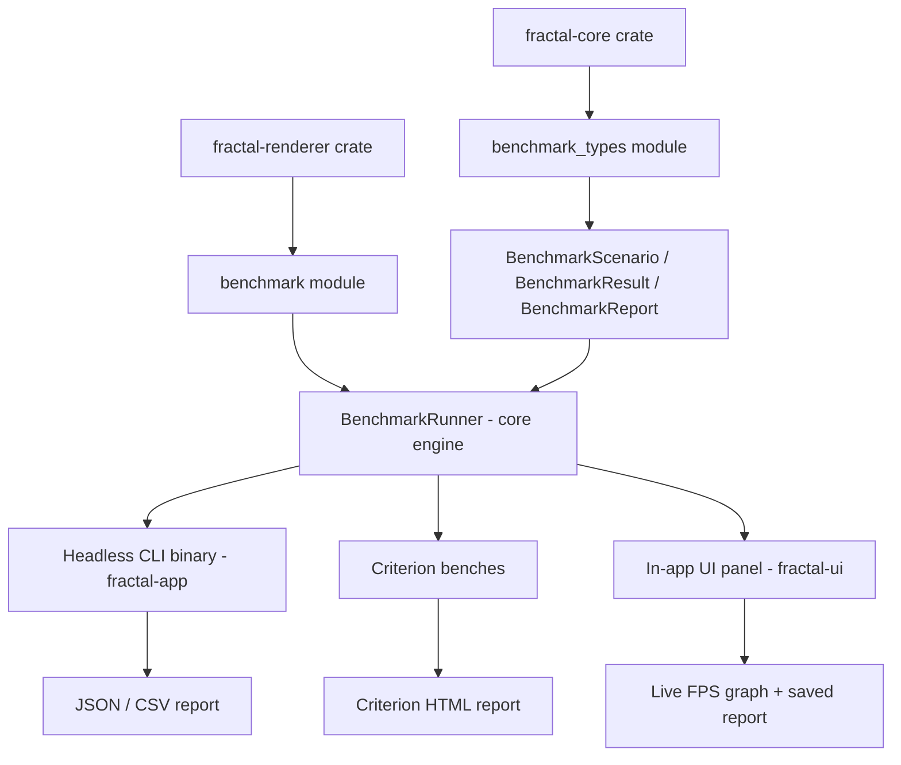
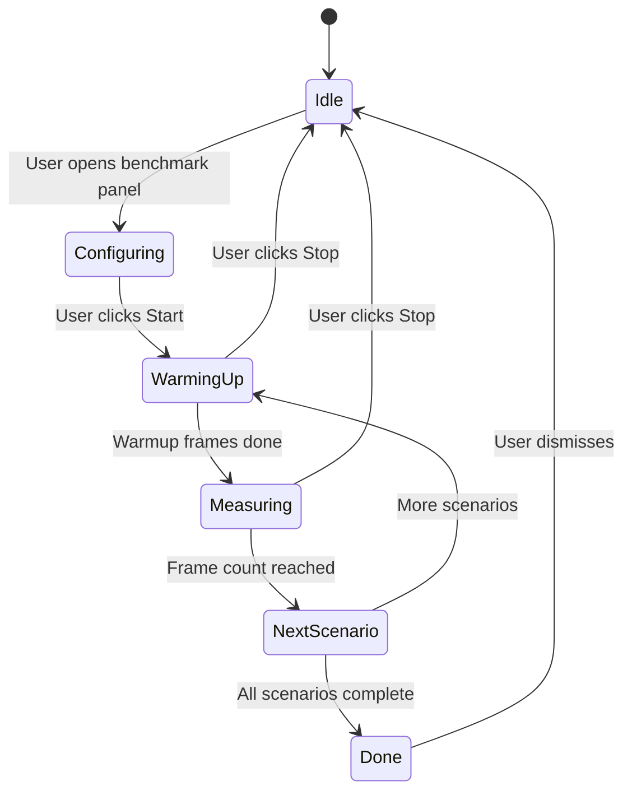

# Rendering Benchmark System

## Overview

A comprehensive GPU rendering benchmark system for ModernFractalViewer with four components:

1. **Core benchmark engine** — reusable `BenchmarkRunner` with scenarios, timing, and statistics
2. **Headless CLI benchmark binary** — automated, no window, JSON/CSV output
3. **Criterion micro-benchmarks** — `cargo bench` integration for regression tracking
4. **In-app benchmark panel** — interactive UI with live graphs and report export

## Architecture



## Component 0: Benchmark Data Types

**Location:** [`crates/fractal-core/src/benchmark_types.rs`](crates/fractal-core/src/benchmark_types.rs)

Data-only types shared by all components. These live in `fractal-core` (not `fractal-renderer`) so that `fractal-ui` can import them without depending on the renderer — preserving the clean `fractal-core` → `fractal-renderer` / `fractal-ui` → `fractal-app` dependency graph.

### Key Types

```rust
use serde::{Serialize, Deserialize};

/// A single benchmark scenario to run
#[derive(Debug, Clone, Serialize, Deserialize)]
pub struct BenchmarkScenario {
    pub name: String,
    pub fractal_params: FractalParams,  // full params including type, power, iterations, etc.
    pub camera: Camera,                 // camera position affects ray march step count
    pub width: u32,
    pub height: u32,
    pub ray_march_config: RayMarchConfig,
    pub color_config: ColorConfig,
    pub lighting_config: LightingConfig,
}

/// Which timing method was used for measurement
#[derive(Debug, Clone, Copy, Serialize, Deserialize)]
pub enum TimingMethod {
    /// GPU-side timestamp queries (most accurate)
    GpuTimestamp,
    /// CPU-side Instant timing with device.poll(Wait) synchronization
    CpuPollWait,
}

/// Timing results for a single scenario
#[derive(Debug, Clone, Serialize, Deserialize)]
pub struct BenchmarkResult {
    pub scenario: String,
    pub timing_method: TimingMethod,
    pub frame_count: u32,
    pub total_time_ms: f64,
    pub min_ms: f64,
    pub max_ms: f64,
    pub avg_ms: f64,
    pub median_ms: f64,
    pub p95_ms: f64,
    pub p99_ms: f64,
    pub avg_fps: f64,
}

/// Full benchmark report
#[derive(Debug, Clone, Serialize, Deserialize)]
pub struct BenchmarkReport {
    pub timestamp: String,
    pub gpu_adapter_name: String,
    pub gpu_backend: String,
    pub timing_method: TimingMethod,
    pub results: Vec<BenchmarkResult>,
}
```

## Component 1: Core Benchmark Engine

**Location:** [`crates/fractal-renderer/src/benchmark.rs`](crates/fractal-renderer/src/benchmark.rs)

A reusable `BenchmarkRunner` struct that both the CLI tool and in-app panel share. This avoids duplicating GPU setup, timing, and statistics logic. Uses the data types from `fractal-core::benchmark_types`.

### Benchmark Matrix

The default benchmark matrix exercises the full rendering pipeline:

| Dimension | Values |
|-----------|--------|
| Fractal types | All 6: Mandelbulb, Menger, Julia3D, Mandelbox, Sierpinski, Apollonian |
| Resolutions | 256×256, 512×512, 1024×1024, 1920×1080 |
| Color modes | Orbit trap (1), iteration (2), normal (3), combined (4) |
| Lighting models | Blinn-Phong (0), PBR (1) |

This produces up to **6 × 4 × 4 × 2 = 192 scenarios** in the full matrix. The CLI supports filtering to run subsets. Color mode 0 (solid) is omitted from the default matrix as it exercises no palette lookup and represents a degenerate lower bound.

> **Optional dimension**: `RayMarchConfig::sample_count` (1/2/4x anti-aliasing) quadruples fragment shader work. Not in the default matrix but available via `--sample-count` CLI flag.

The default matrix uses `FractalParams::for_type()` for each fractal type (which sets appropriate power, iterations, bailout, etc.) and `Camera::default()` (position `(0, 0, 3)` looking at origin) for a canonical, reproducible camera angle.

### Timing Strategy

The renderer uses a fullscreen triangle ray-marching shader — all work is in the fragment shader. Timing approach:

1. **Warm-up phase**: Render 5 frames to warm up the GPU driver and pipeline caches, discarding results
2. **Measurement phase**: Render N frames per scenario, default N=50 for CLI, configurable
3. **GPU timing**: Use `device.poll(Maintain::Wait)` after each `queue.submit()` to ensure the GPU has finished before recording the CPU-side timestamp — this measures actual GPU execution time, not just submission time
4. **Per-frame timing**: Record `Instant::elapsed()` between submit+poll pairs
5. **Statistics**: Compute min, max, avg, median, p95, p99 from the frame time array

> **Note on wgpu timestamp queries**: wgpu supports GPU-side timestamp queries via `Features::TIMESTAMP_QUERY`, but not all adapters support it. The benchmark should opportunistically use timestamp queries when available, and fall back to CPU-side timing otherwise.

### GPU Timestamp Query Pipeline (when supported)

When the adapter supports `Features::TIMESTAMP_QUERY`:

1. **Device creation**: Request `Features::TIMESTAMP_QUERY` in `required_features` (fall back gracefully if not available)
2. **QuerySet**: Create a `wgpu::QuerySet` with `QueryType::Timestamp` and count = 2 (start + end)
3. **Per-frame**: Call `encoder.write_timestamp(&query_set, 0)` before the render pass and `encoder.write_timestamp(&query_set, 1)` after
4. **Resolve**: Call `encoder.resolve_query_set(&query_set, 0..2, &resolve_buffer, 0)` to copy timestamps to a mappable buffer
5. **Read back**: Map and read the two `u64` timestamp values
6. **Convert**: `(end - start) * queue.get_timestamp_period()` gives nanoseconds, convert to milliseconds

The `BenchmarkResult::timing_method` field records which method was used so results from different runs are comparable.

### Headless GPU Setup

Similar to [`snapshot_tests.rs`](crates/fractal-renderer/tests/snapshot_tests.rs:22), create a headless `wgpu::Instance` + adapter + device without a surface. **Key differences from snapshot tests:**

- Use `PowerPreference::HighPerformance` (not `LowPower`) to benchmark the discrete GPU on hybrid laptops
- Request `Features::TIMESTAMP_QUERY` when available (fall back if unsupported)
- Use `adapter.limits()` for device limits (consistent with production app)

### Lightweight Benchmark Render Target

**Do NOT use `ThumbnailCapture`** — it allocates a staging buffer for pixel readback that benchmarks don't need. Instead, create a minimal render-only texture:

```rust
let texture = device.create_texture(&wgpu::TextureDescriptor {
    label: Some("Benchmark Target"),
    size: wgpu::Extent3d { width, height, depth_or_array_layers: 1 },
    mip_level_count: 1,
    sample_count: 1,
    dimension: wgpu::TextureDimension::D2,
    format: wgpu::TextureFormat::Rgba8Unorm,  // portable, no surface negotiation
    usage: wgpu::TextureUsages::RENDER_ATTACHMENT,  // no COPY_SRC needed
    view_formats: &[],
});
let view = texture.create_view(&Default::default());
```

This avoids the staging buffer allocation and copy overhead, giving measurements closer to real rendering performance.

## Component 2: Headless CLI Binary

**Location:** [`crates/fractal-app/src/bin/bench.rs`](crates/fractal-app/src/bin/bench.rs)

A standalone binary in the `fractal-app` crate (which already depends on `fractal-core` and `fractal-renderer`), runnable via:

```bash
# Run full benchmark matrix
cargo run -p fractal-app --bin fractal-bench --features benchmark --release

# Filter by fractal type
cargo run -p fractal-app --bin fractal-bench --features benchmark --release -- --fractal mandelbulb

# Filter by resolution
cargo run -p fractal-app --bin fractal-bench --features benchmark --release -- --resolution 1920x1080

# Custom frame count
cargo run -p fractal-app --bin fractal-bench --features benchmark --release -- --frames 100

# Output format
cargo run -p fractal-app --bin fractal-bench --features benchmark --release -- --output json > bench-results.json
cargo run -p fractal-app --bin fractal-bench --features benchmark --release -- --output csv > bench-results.csv

# Quick mode: reduced matrix for fast feedback
cargo run -p fractal-app --bin fractal-bench --features benchmark --release -- --quick
```

### CLI Arguments

| Flag | Description | Default |
|------|-------------|---------|
| `--fractal <type>` | Filter to one fractal type | all |
| `--resolution <WxH>` | Filter to one resolution | all |
| `--frames <N>` | Frames per scenario | 50 |
| `--warmup <N>` | Warm-up frames | 5 |
| `--output <format>` | Output format: `text`, `json`, `csv` | `text` |
| `--quick` | Quick mode: 1 resolution, 10 frames | off |
| `--color-mode <N>` | Filter to one color mode | all |
| `--lighting <model>` | Filter: `phong` or `pbr` | all |

### Output Example - Text

```
=== ModernFractalViewer Rendering Benchmark ===
GPU: NVIDIA GeForce RTX 4090 (Vulkan)
Date: 2026-03-24T13:00:00Z

Mandelbulb @ 512x512 (orbit-trap, PBR)
  Frames: 50 | Min: 1.23ms | Avg: 1.45ms | Max: 2.01ms | P99: 1.89ms | FPS: 689.7

Menger @ 512x512 (orbit-trap, PBR)  
  Frames: 50 | Min: 0.89ms | Avg: 1.02ms | Max: 1.34ms | P99: 1.28ms | FPS: 980.4
...
```

### Output Example - JSON

```json
{
  "timestamp": "2026-03-24T13:00:00Z",
  "gpu": "NVIDIA GeForce RTX 4090",
  "backend": "Vulkan",
  "results": [
    {
      "scenario": "Mandelbulb @ 512x512 / orbit-trap / PBR",
      "frame_count": 50,
      "min_ms": 1.23,
      "avg_ms": 1.45,
      "max_ms": 2.01,
      "median_ms": 1.41,
      "p95_ms": 1.78,
      "p99_ms": 1.89,
      "avg_fps": 689.7
    }
  ]
}
```

### Dependencies to Add

```toml
# In fractal-app/Cargo.toml [dependencies]
clap = { version = "4", features = ["derive"], optional = true }

# In fractal-app/Cargo.toml [features]
benchmark = ["dep:clap"]

# In fractal-app/Cargo.toml [[bin]] (add alongside existing fractal-viewer bin)
[[bin]]
name = "fractal-bench"
path = "src/bin/bench.rs"
required-features = ["benchmark"]
```

> **Why fractal-app and not fractal-renderer?** The renderer crate is a focused library with no existing binaries. `fractal-app` already depends on both `fractal-core` and `fractal-renderer`, so it is the natural home for the CLI binary. The core benchmark engine (`BenchmarkRunner`) stays in `fractal-renderer` where the GPU rendering logic lives.

## Component 3: Criterion Micro-Benchmarks

**Location:** [`crates/fractal-renderer/benches/render_bench.rs`](crates/fractal-renderer/benches/render_bench.rs)

Criterion benchmarks that integrate with `cargo bench` and produce HTML reports with statistical analysis and regression detection.

```toml
# In fractal-renderer/Cargo.toml
[dev-dependencies]
criterion = { version = "0.5", features = ["html_reports"] }

[[bench]]
name = "render_bench"
harness = false
```

### Benchmark Groups

1. **per_fractal_type**: Renders each fractal type at 512×512, measures full frame time (uniform upload + render + poll)
2. **per_resolution**: Renders Mandelbulb at each resolution, measures scaling behavior
3. **pipeline_creation**: Measures shader compilation and pipeline creation time
4. **color_mode_comparison**: Compares rendering cost of different color modes
5. **lighting_model_comparison**: Compares Blinn-Phong vs PBR overhead

> **Removed: `uniform_upload` group.** Measuring `queue.write_buffer()` for a 512-byte uniform buffer is not meaningful — the actual GPU upload happens asynchronously at submit time. Uniform upload cost is captured as part of the full-frame measurements in other groups.

### GPU Iteration Strategy

Standard Criterion `iter()` does not work for GPU benchmarks because the GPU requires explicit synchronization. Use these strategies:

- **Render benchmarks** (`per_fractal_type`, `per_resolution`, `color_mode_comparison`, `lighting_model_comparison`): Use `bencher.iter_custom(|iters| { ... })` to submit N frames, call `device.poll(Wait)` after all submissions, and return the total `Duration`.
- **Pipeline creation**: Use `bencher.iter_batched(|| setup, |pipeline| drop(pipeline), BatchSize::PerIteration)` to ensure fresh shader compilation each iteration (Criterion's warm-up would otherwise eat the very thing being measured).

### Usage

```bash
# Run all benchmarks
cargo bench -p fractal-renderer

# Run specific benchmark group
cargo bench -p fractal-renderer -- per_fractal_type

# Compare against baseline
cargo bench -p fractal-renderer -- --save-baseline main
# ... make changes ...
cargo bench -p fractal-renderer -- --baseline main
```

## Component 4: In-App Benchmark Panel

**Location:** [`crates/fractal-ui/src/panels/benchmark_panel.rs`](crates/fractal-ui/src/panels/benchmark_panel.rs)

An egui panel accessible from the UI that runs benchmarks interactively with live visualization.

### UI State

Add to [`UiState`](crates/fractal-ui/src/state.rs):

```rust
/// Benchmark state
pub benchmark_running: bool,
pub benchmark_results: Vec<BenchmarkResult>,
pub benchmark_frame_times: Vec<f64>,  // rolling buffer for live graph
pub benchmark_current_scenario: String,
pub benchmark_progress: f32,  // 0.0 to 1.0
pub show_benchmark: bool,
pub pending_benchmark: bool,  // signal to app to start benchmark
```

### Panel Features

1. **Configuration section**: Checkboxes for fractal types, resolution picker, frame count slider
2. **Start/Stop button**: Triggers the benchmark run
3. **Live frame time graph**: Rolling line chart of per-frame GPU time using egui_plot or manual painter
4. **Progress bar**: Shows current scenario and overall progress
5. **Results table**: Sortable table of completed scenarios with all stats
6. **Export button**: Saves results to JSON file via file dialog

### Integration with App Loop

The in-app benchmark measures the **fractal render pass only** (not the full frame including egui), using a separate offscreen texture. During a benchmark run:

1. The app disables UI interaction except the stop button
2. Each frame, the benchmark controller advances through scenarios
3. Frame times are measured using `Instant` around the fractal render call (not including egui)
4. After all scenarios complete, results are stored in `UiState`

### State Management

- **Splash guard**: Only honor `pending_benchmark` when `self.splash.is_none()` — never start a benchmark during the splash screen
- **Save/restore**: Snapshot the user's `UiState` params (fractal_params, camera, ray_march_config, color_config, lighting_config, vsync) before the benchmark run starts, and restore them when it completes or is stopped
- **VSync**: Force `PresentMode::AutoNoVsync` during the benchmark to avoid capping at display refresh rate. Restore the user's original VSync setting after
- **Block exports**: Set `pending_export = false` and ignore export requests while `benchmark_running` is true
- **Block session operations**: Ignore save/load/delete requests during benchmark



### Frame Time Graph

The graph shows a rolling window of the last 200 frame times as a line chart, drawn with egui's `Plot` widget or manual `Painter` calls:

- X axis: frame index
- Y axis: frame time in ms
- Color-coded: green under target, yellow warning, red over budget
- Horizontal reference lines at 16.67ms and 33.33ms

## File Changes Summary

### New Files

| File | Purpose |
|------|---------|
| `crates/fractal-core/src/benchmark_types.rs` | Data types: `BenchmarkScenario`, `BenchmarkResult`, `BenchmarkReport`, `TimingMethod` (serde-enabled, no GPU deps) |
| `crates/fractal-renderer/src/benchmark.rs` | Core benchmark engine: `BenchmarkRunner`, headless GPU setup, render loop, timing, statistics |
| `crates/fractal-app/src/bin/bench.rs` | Headless CLI binary with clap argument parsing |
| `crates/fractal-renderer/benches/render_bench.rs` | Criterion benchmark suite |
| `crates/fractal-ui/src/panels/benchmark_panel.rs` | In-app egui benchmark panel |

### Modified Files

| File | Change |
|------|--------|
| `crates/fractal-core/src/lib.rs` | Add `pub mod benchmark_types;` and re-exports |
| `crates/fractal-renderer/Cargo.toml` | Add criterion `[[bench]]` and dev-dep |
| `crates/fractal-renderer/src/lib.rs` | Add `pub mod benchmark;` |
| `crates/fractal-app/Cargo.toml` | Add `clap` optional dep, `benchmark` feature, `[[bin]]` section for fractal-bench |
| `crates/fractal-ui/src/state.rs` | Add benchmark-related fields to `UiState` |
| `crates/fractal-ui/src/panels/mod.rs` | Add `benchmark_panel` module |
| `crates/fractal-ui/src/panels/control_settings_panel.rs` | Add benchmark button or menu entry |
| `crates/fractal-app/src/app.rs` | Add benchmark orchestration logic in render loop (state save/restore, splash guard, export blocking) |
| `docs/DEVELOPMENT_GUIDE.md` | Document benchmark feature |

> **Note:** `crates/fractal-ui/Cargo.toml` does **not** need changes — benchmark data types live in `fractal-core`, which `fractal-ui` already depends on.

## Implementation Order

0. **Data types** (`fractal-core/src/benchmark_types.rs`) — BenchmarkScenario, BenchmarkResult, BenchmarkReport, TimingMethod
1. **Core engine** (`fractal-renderer/src/benchmark.rs`) — BenchmarkRunner, headless GPU setup, timing, statistics
2. **Headless CLI** (`fractal-app/src/bin/bench.rs`) — enables immediate testing without UI
3. **Criterion benchmarks** (`fractal-renderer/benches/render_bench.rs`) — regression detection with `iter_custom`
4. **UI state + panel** (`state.rs`, `benchmark_panel.rs`) — in-app panel with live graph
5. **App integration** (`app.rs`) — wire benchmark into render loop with state save/restore, splash guard, export blocking
6. **Documentation** — update dev guide

## Considerations

- **Release mode**: Benchmarks should always run in `--release` for meaningful results. The CLI binary's `required-features` ensures it's built with optimizations.
- **GPU warm-up**: First few frames are always slower due to shader compilation caching. The warm-up phase handles this.
- **V-Sync**: The benchmark should disable V-Sync during measurement to avoid capping at display refresh rate. The in-app benchmark should temporarily set `PresentMode::AutoNoVsync` and restore the user's setting afterward. The headless CLI has no surface so V-Sync is not a factor.
- **Platform compatibility**: The headless approach works on all platforms including CI runners without displays, though GPU availability still varies. The CLI should exit gracefully with a "no GPU" message when no adapter is found.
- **No pixel readback needed**: Unlike snapshot tests, benchmarks only need timing — we skip the staging buffer entirely and render to a `RENDER_ATTACHMENT`-only texture. This is faster and more representative of real rendering cost.
- **`wgpu` timestamp queries**: When `Features::TIMESTAMP_QUERY` is available, use `write_timestamp` on the command encoder for precise GPU-side timing. Fall back to CPU `Instant` timing with `device.poll(Wait)` otherwise. Results record which method was used via `TimingMethod` enum.
- **PowerPreference**: Use `HighPerformance` for benchmarks (not `LowPower` like snapshot tests) to ensure the discrete GPU is selected on hybrid laptops. Print `adapter.get_info()` in the report so users can verify which GPU was selected.
- **Texture format**: Headless benchmarks use `Rgba8Unorm` (portable, no surface to negotiate with). Note that the production app typically uses `Bgra8Unorm` on Windows — format differences can have minor performance impact on some GPUs.
- **In-app resolution**: The in-app benchmark panel should offer a "Current viewport" resolution option alongside the fixed sizes (256², 512², 1024², 1920×1080) since users care about performance at their actual display resolution.
