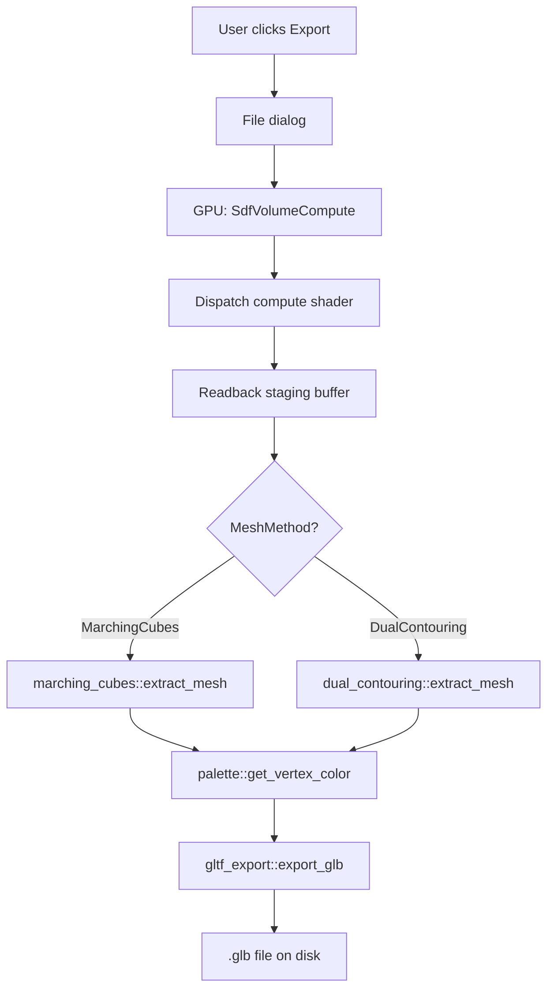
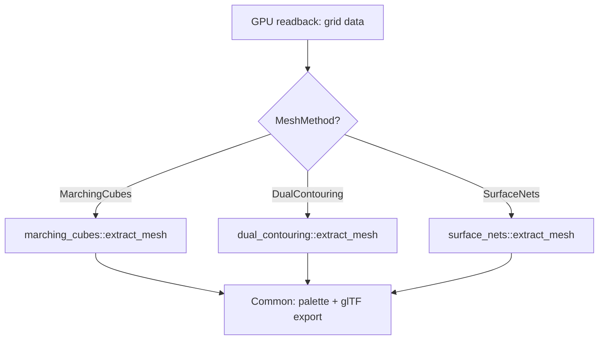

# Surface Nets Integration & Dual Contouring Improvements

## Problem Statement

The current Dual Contouring mesh export produces **noisy, non-smooth surfaces and normals** when applied to fractals with high-frequency sharp features. The user wants to:

1. **Investigate `fast_surface_nets`** as an alternative meshing method that may produce smoother results
2. **Improve the existing Dual Contouring** normal quality
3. **Keep the existing GPU export pipeline** — only the CPU-side mesh extraction changes

## Current Architecture



### Key Data Flow

1. **GPU Phase** — [`SdfVolumeCompute`](crates/fractal-renderer/src/compute.rs) dispatches [`sdf_volume.wgsl`](crates/fractal-renderer/shaders/sdf_volume.wgsl) to sample the SDF on a 3D grid. Output: `Vec<[f32; 2]>` where each element is `[distance, trap_value]`. Grid layout: `index = x + y * vx + z * vx * vy` with `vx = vy = vz = resolution + 1`.

2. **CPU Phase** — The grid is passed to either [`marching_cubes::extract_mesh()`](crates/fractal-core/src/mesh/marching_cubes.rs) or [`dual_contouring::extract_mesh()`](crates/fractal-core/src/mesh/dual_contouring.rs). Both produce [`MeshData`](crates/fractal-core/src/mesh/mod.rs:14) with positions, normals, colors, and triangle indices.

3. **Export Phase** — Vertex colors are computed from trap values via the palette, then [`gltf_export::export_glb()`](crates/fractal-core/src/mesh/gltf_export.rs) writes the GLB file.

### Where Surface Nets Fits In

`fast_surface_nets` **replaces only step 2** — it's a different CPU-side mesh extraction algorithm. The GPU sampling and GLB export remain identical. This is exactly the same pattern as how Marching Cubes and Dual Contouring are already swappable.



## Why Surface Nets May Produce Better Results

| Algorithm | Vertex Placement | Connectivity | Sharp Features | Surface Smoothness |
|-----------|-----------------|--------------|----------------|-------------------|
| Marching Cubes | Edge intersections | Per-cell lookup table | Poor | Moderate |
| Dual Contouring | QEF minimization in cell | Quad/tri from sign-change edges | Good in theory, but noisy with fractal SDF | Can be noisy |
| **Surface Nets** | **Averaged edge intersections** | **Shared vertices across cells** | **Rounded/smooth** | **Inherently smooth** |

Surface Nets places vertices at the **average of all edge crossing points** within a cell, which naturally smooths out high-frequency noise. For fractals where the SDF gradient is chaotic, this averaging acts as a low-pass filter — producing cleaner geometry at the cost of rounding sharp corners.

## Detailed Implementation Plan

### 1. Add `fast_surface_nets` Dependency

**Files:** [`Cargo.toml`](Cargo.toml) (workspace), [`crates/fractal-core/Cargo.toml`](crates/fractal-core/Cargo.toml)

- Add `fast_surface_nets = "0.2"` to workspace dependencies
- Add it to `fractal-core`'s `[dependencies]`

The crate's API expects:
- A 3D array accessed via `ndarray`-style indexing, **OR** a flat `SdfVolumeCompute`-compatible padded array
- Actually, `fast_surface_nets` v0.2 works with `ndarray::Array3<f32>` **or** with its own `SurfaceNetsBuffer` + a function closure `Fn([i32; 3]) -> f32`

Looking at the crate docs more carefully: `fast_surface_nets::surface_nets()` takes:
- An `&[f32]` SDF array
- Dimensions `[usize; 3]`  
- The array is indexed as `x + y * x_size + z * x_size * y_size`

This is **exactly** the same layout as our GPU compute output, just with the trap value stripped. Perfect fit.

### 2. Create `surface_nets.rs` Module

**File:** [`crates/fractal-core/src/mesh/surface_nets.rs`](crates/fractal-core/src/mesh/surface_nets.rs) (new)

This module will:

1. **Extract SDF-only values** from the `[f32; 2]` grid (strip trap values)
2. **Call `fast_surface_nets::surface_nets()`** with the SDF array and grid dimensions
3. **Map positions** from grid-space back to world-space using bounds_min/bounds_max
4. **Compute normals** from SDF gradient via central differences (reusing the same approach as DC/MC)
5. **Interpolate trap values** at each vertex position for coloring
6. **Return `MeshData`** matching the existing interface

The function signature will match the existing convention:
```rust
pub fn extract_mesh(
    grid: &[[f32; 2]],
    dims: [u32; 3],
    bounds_min: [f32; 3],
    bounds_max: [f32; 3],
    iso_level: f32,
    compute_normals: bool,
    progress: Option<&dyn Fn(f32)>,
) -> MeshData
```

**Key detail:** `fast_surface_nets` returns vertex positions in grid-index space (floating point grid coordinates). We need to transform these to world-space:
```
world_pos[i] = bounds_min[i] + grid_pos[i] * (bounds_max[i] - bounds_min[i]) / dims[i]
```

### 3. Update [`MeshMethod`](crates/fractal-core/src/mesh/mod.rs:27) Enum

**File:** [`crates/fractal-core/src/mesh/mod.rs`](crates/fractal-core/src/mesh/mod.rs)

Add a `SurfaceNets` variant:
```rust
pub enum MeshMethod {
    MarchingCubes,
    DualContouring,
    SurfaceNets,  // NEW
}
```

Update `Display` impl and `Default`.

### 4. Update Export Panel UI

**File:** [`crates/fractal-ui/src/panels/export_panel.rs`](crates/fractal-ui/src/panels/export_panel.rs)

Add `SurfaceNets` to the method combo-box, alongside the existing Dual Contouring and Marching Cubes options.

### 5. Wire Up in App Export Thread

**File:** [`crates/fractal-app/src/app.rs`](crates/fractal-app/src/app.rs) — [`spawn_export_thread()`](crates/fractal-app/src/app.rs:1448)

Add `MeshMethod::SurfaceNets` arm to the match in the export thread:
```rust
MeshMethod::SurfaceNets => surface_nets::extract_mesh(
    &grid, [resolution; 3], bounds_min, bounds_max,
    iso_level, compute_normals, Some(&progress_cb),
),
```

### 6. Improve Dual Contouring Normal Quality

**File:** [`crates/fractal-core/src/mesh/dual_contouring.rs`](crates/fractal-core/src/mesh/dual_contouring.rs)

The current [`compute_gradient_normals()`](crates/fractal-core/src/mesh/dual_contouring.rs:475) snaps each vertex to the nearest grid point and uses that single point's central-difference gradient. For fractal SDFs with high-frequency features, this produces noisy normals because:

1. The vertex may sit between grid points, but the gradient is sampled at the nearest grid point only
2. No smoothing is applied — each vertex normal is independent

**Improvement: Trilinear gradient interpolation + optional Laplacian smoothing**

#### A. Trilinear Gradient Interpolation
Instead of snapping to the nearest grid point, **trilinearly interpolate** the gradient from the 8 surrounding grid corners:

```
fx, fy, fz = continuous grid coordinates of vertex
gx, gy, gz = floor(fx), floor(fy), floor(fz)  (integer grid)
tx, ty, tz = fx - gx, fy - gy, fz - gz       (fractional parts)

Sample gradient at all 8 corners: G000, G001, G010, ..., G111
Interpolate trilinearly using tx, ty, tz
```

This produces much smoother normals because the gradient varies continuously across the cell rather than jumping between discrete grid values.

#### B. Laplacian Normal Smoothing (Post-process)
After computing all normals, apply 1-2 iterations of Laplacian smoothing:

```
For each vertex v:
    new_normal[v] = normalize(
        normal[v] + λ * Σ(normal[neighbor]) / num_neighbors
    )
```

Where neighbors are found from the triangle adjacency. This is especially effective for fractal surfaces where the underlying SDF gradient is chaotic.

We'll add this as a post-processing step that runs when `compute_normals` is true, controlled by a smoothing parameter (hardcoded initially, can be exposed in UI later).

## Files Changed Summary

| File | Change |
|------|--------|
| [`Cargo.toml`](Cargo.toml) | Add `fast_surface_nets = "0.2"` to workspace deps |
| [`crates/fractal-core/Cargo.toml`](crates/fractal-core/Cargo.toml) | Add `fast_surface_nets` dependency |
| [`crates/fractal-core/src/mesh/mod.rs`](crates/fractal-core/src/mesh/mod.rs) | Add `SurfaceNets` variant to `MeshMethod`, add `pub mod surface_nets` |
| `crates/fractal-core/src/mesh/surface_nets.rs` | **NEW** — Bridge `fast_surface_nets` crate to `MeshData` |
| [`crates/fractal-core/src/mesh/dual_contouring.rs`](crates/fractal-core/src/mesh/dual_contouring.rs) | Trilinear gradient interpolation + Laplacian normal smoothing |
| [`crates/fractal-ui/src/panels/export_panel.rs`](crates/fractal-ui/src/panels/export_panel.rs) | Add Surface Nets to method combo-box |
| [`crates/fractal-app/src/app.rs`](crates/fractal-app/src/app.rs) | Add `SurfaceNets` arm in `spawn_export_thread` |

## Risk Assessment

- **`fast_surface_nets` API compatibility**: The crate expects a flat `[f32]` array with `x + y*sx + z*sx*sy` indexing — matches our GPU output exactly (just need to strip the trap channel).
- **No GPU changes needed**: The compute shader and readback pipeline are method-agnostic.
- **Serialization**: New `MeshMethod::SurfaceNets` variant must be added to serde — existing saved `ExportConfig`s with `MeshMethod::DualContouring` or `MeshMethod::MarchingCubes` will still deserialize correctly since we're only adding a new variant.
- **Normal smoothing**: Laplacian smoothing requires building a vertex adjacency structure from triangle indices — O(V + T) time and memory, acceptable for mesh export.
